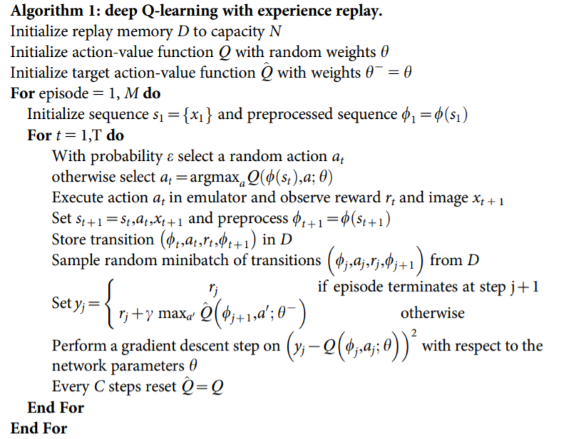

Description of the implementation

For this problem of navigation it was use the Q-network Algorithm using Expirience Replay, Fixed Target and Exploration Decay.

Learning Algorith

Recalling the algorithm from the paper [Human-level control through deep reinforcement learning](https://storage.googleapis.com/deepmind-media/dqn/DQNNaturePaper.pdf) we got:

Arquitecture

Result

How to Improve
