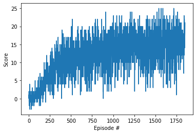

# Navigation problem - Deep Q-Network with Pytorch

For this problem of navigation it was use the Q-network Algorithm using Expirience Replay, Fixed Target and Exploration Decay.

### Learning Algorith

Recalling the algorithm from the paper [Human-level control through deep reinforcement learning](https://storage.googleapis.com/deepmind-media/dqn/DQNNaturePaper.pdf) we got:


it has been implemented in the Agent class of the [dqn_agentes.py](./dqn_agents.py) script. (all comment was remove but it can be found in the code)

in the construction of the class it's been replicated the first 3 lines of the algorithm. initialization of the Newtworks (local for training and target for evaluation) 

```python
    def __init__(self, state_size, action_size, seed):
        
        self.state_size = state_size
        self.action_size = action_size
        self.seed = random.seed(seed)

        self.qnetwork_local = QNetwork(state_size, action_size, seed).to(device)
        self.qnetwork_target = QNetwork(state_size, action_size, seed).to(device)
        self.optimizer = optim.Adam(self.qnetwork_local.parameters(), lr=LR)

        self.memory = ReplayBuffer(action_size, BUFFER_SIZE, BATCH_SIZE, seed)
        
        self.t_step = 0
```

the do while lines in the algorithm starts in the training enviroment [trainer.py](./trainer.py) In the script is declare in a dqn function:

```python

def dqn(agent,n_episodes=2000, max_t=500, eps_start=1.0, eps_end=0.01, eps_decay=0.995):

    scores = []                       
    scores_window = deque(maxlen=100)  
    eps = eps_start                    
    
    for i_episode in range(1, n_episodes+1):        
        env_info = env.reset(train_mode=True)[brain_name]
        state = env_info.vector_observations[0] 
        score = 0
        while True: 
            action = agent.act(state, eps)
            env_info = env.step(action.astype(int))[brain_name]            
            next_state = env_info.vector_observations[0]
            reward = env_info.rewards[0]
            done = env_info.local_done[0]
            
            agent.step(state, action, reward, next_state, done)
            
            score += reward
            state = next_state
            
            if done:
                break 
        
        scores_window.append(score)
        scores.append(score)
        eps = max(eps_end, eps_decay*eps) 

        print('\rEpisode {}\tAverage Score: {:.2f}'.format(i_episode, np.mean(scores_window)), end="")
        
        if i_episode % 100 == 0:
            print('\rEpisode {}\tAverage Score: {:.2f}'.format(i_episode, np.mean(scores_window)))
        
        if np.mean(scores_window)>=SCORE_WHEN_SOLVED:
            print('\nEnvironment solved in {:d} episodes!\tAverage Score: {:.2f}'.format(i_episode, np.mean(scores_window)))
            agent.save()
            break
    
    return scores

```
the steps and learing with the rules are implemente in the step and Act function:

the importan part of this is the update and how it learns. 

```python
        ##compute and minimize the loss
        state_action_values = self.q_value(states,actions)
        
        next_state_action_values = self.max_q_value(next_states)
        expected_state_action_values = (next_state_action_values * gamma*(1-dones)) + rewards
        
        loss = F.mse_loss(state_action_values, expected_state_action_values)        
        
        # Optimize the model
        self.optimizer.zero_grad()
        loss.backward()
        self.optimizer.step()    
```
using the functions

```python
    def q_value(self,state,action):
        q_values = self.qnetwork_local(state)
        state_action_value = q_values.gather(1,action)
        return state_action_value
        
    def max_q_value(self,state):
        max_state_action_value = self.qnetwork_target(state).max(1)[0].detach()
        return max_state_action_value.unsqueeze(1)


```

### Deep neural network

for this solution we use a Neural network consist on

3 blocks of Batchnormalized linear layers with ReLu activations, in which the first use a Dropout layer in the training Step. [models.py](./models.py)

```python
    def __init__(self, state_size, action_size, seed):

        super(QNetwork, self).__init__()
        self.seed = torch.manual_seed(seed)       
        self.l1 = nn.Linear(state_size,256)
        self.bn1 = nn.BatchNorm1d(256)
        self.dp1 = nn.Dropout(0.2)
        self.l2 = nn.Linear(256,324)
        self.bn2 = nn.BatchNorm1d(324)       
        self.l3 = nn.Linear(324,512)
        self.bn3 = nn.BatchNorm1d(512)
        self.l4 = nn.Linear(512,action_size)
        
    def forward(self, x):
        x = self.dp1(F.relu(self.bn1(self.l1(x))))
        x = F.relu(self.bn2(self.l2(x)))
        x = F.relu(self.bn3(self.l3(x)))
        return F.relu(self.l4(x))

```

### Result

after mora that 1500 episodes the agent learn to Solve



### How to Improve

For improvement of the Agent, we can start with different combination of Hyperparameters. Also we can try to implement a Double Q-Network (given that the score has high volatility) or a Actor Critic method for estability.

One important aspect is that if we watch the Agent act, we are going to see that the agent got stuck after a score of 16, because in the nearest area of action of the agent it doesnt have more bananas, so it has only learn that the exploration has to be in circles. But to improve that it might be useful to use Pixels or try a [GO-Explore](https://arxiv.org/abs/1901.10995) aproach. 
